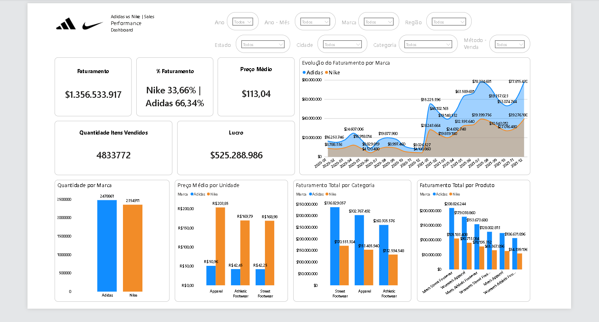

# 📊 Nike vs Adidas - Análise de Vendas | Sales Analysis

## 🎯 Objetivo | Objective
Realizar uma análise comparativa do desempenho de vendas entre Nike e Adidas.

Analyze and compare the sales performance of Nike and Adidas.

---

## ⚙️ Ferramentas | Tools
- Power BI
- Data Analysis

---

## 📈 Principais Insights | Key Insights
- Adidas representa ~66% do faturamento  
- Nike tem maior preço médio em algumas categorias  
- Algumas categorias concentram a receita  

- Adidas represents ~66% of revenue  
- Nike shows higher average price in some categories  
- Certain categories concentrate revenue  

---

## 🖼️ Dashboard

